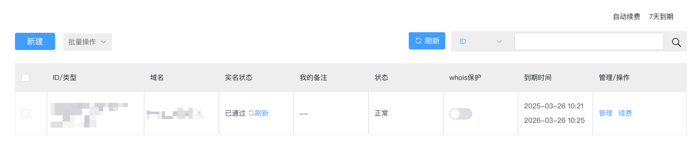
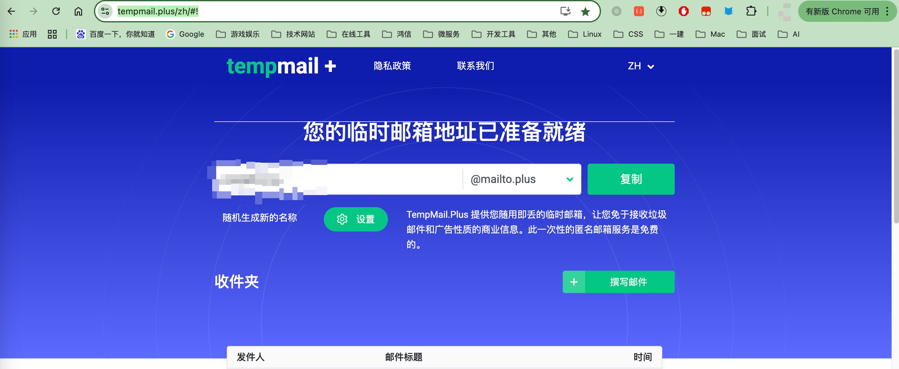
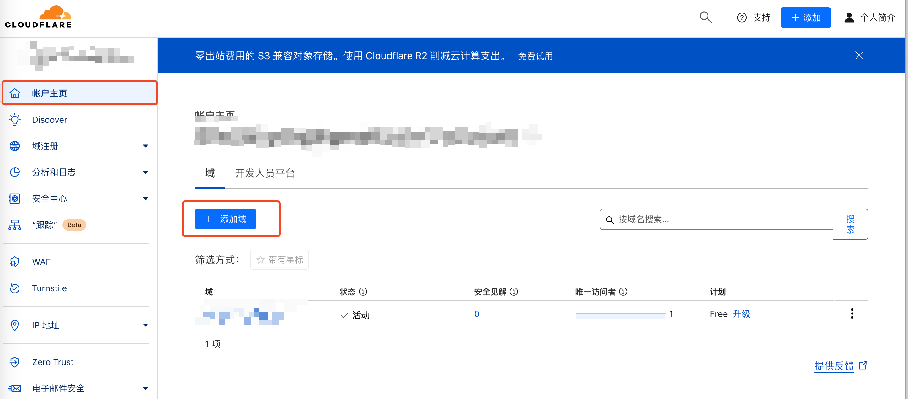
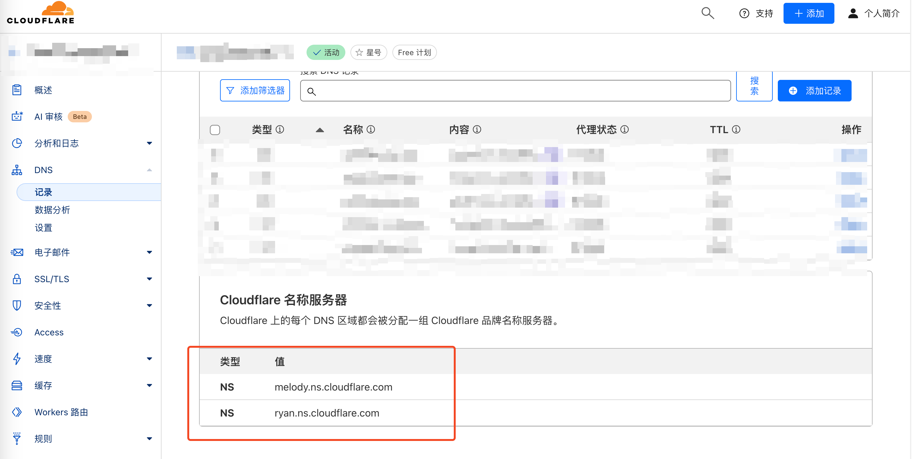
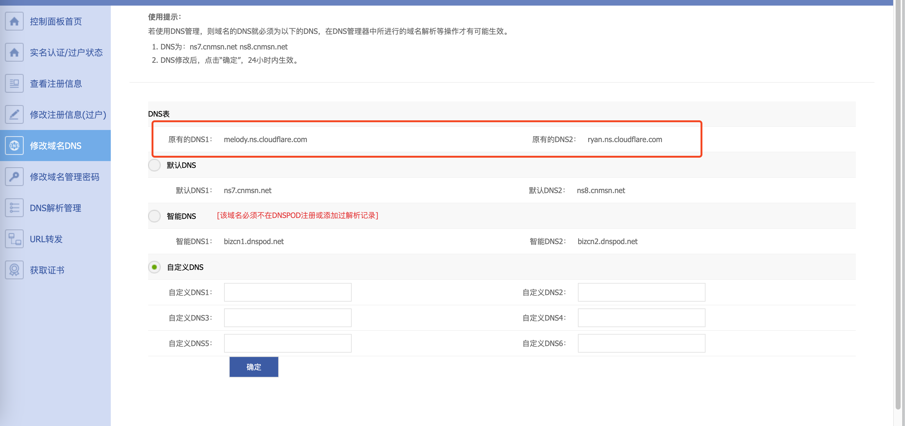
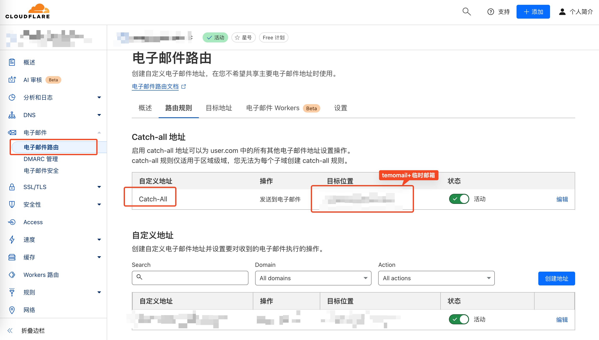
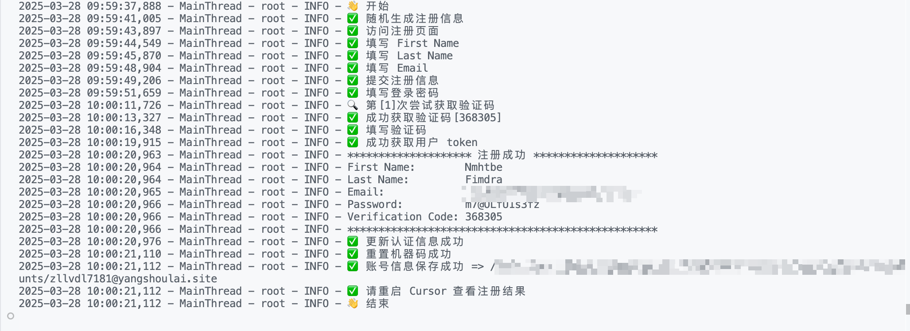

# Cursor 注册助手

这是一个用于自动化注册 Cursor 账号的工具。该工具可以自动完成注册流程，包括邮箱验证码获取等功能。

## 功能特点

- 自动生成随机用户信息
- 自动完成注册流程
- 自动获取邮箱验证码
- 支持绕过 Cloudflare Turnstile 检测
- 支持代理设置
- 支持无头浏览器模式

## 环境要求

- Python 3.8+
- Chrome 浏览器
- 临时邮箱账号（推荐使用 tempmail.plus）

## 安装步骤

1. 申请自建邮箱域名
   可以去[硅云](https://www.vpsor.cn/)申请，新用户首年 0 元
   

2. 申请临时邮箱
   从[tempmail+](https://tempmail.plus/zh/#!)申请临时邮箱
   

3. 去 CloudFlare 配置邮箱路由

   1. 账户主页添加申请的邮箱域名
      
   2. 获取 CloudFlare 名称服务器
      
   3. 去硅云配置域名名称服务器
      
   4. 配置邮箱路由
      

4. 克隆项目

```bash
git clone https://github.com/yourusername/cursor-register.git
cd cursor-register
```

5. 安装依赖

```bash
pip install -r requirements.txt
```

6. 配置环境变量
   创建 `.env` 文件并设置以下变量：

```env
# 临时邮箱配置
MAIL_ADDR_AT_TEMP_MAIL_PLUS=<申请的临时邮箱，例如your_email@mailto.plus>
# 自建邮箱域名
MAIL_DOMAIN=<申请的邮箱域名，例如your_domain.com>

# 浏览器配置
BROWSER_USER_AGENT=<浏览器UA，配置成自己本地浏览器的 UA>
BROWSER_PROXY=<浏览器代理，例如http://your-proxy-ip:port>  # 可选
BROWSER_HEADLESS=true  # 是否使用无头浏览器
```

## 使用方法

1. 运行注册程序

```bash
python src/main.py
```



2. 程序会自动：

   - 生成随机用户信息
   - 打开浏览器访问注册页面
   - 填写注册信息
   - 获取验证码
   - 完成注册
   - 保存账号信息

3. 注册成功后，账号信息会保存在 `accounts` 目录下

## 目录结构

```
cursor-register/
├── src/
│   ├── browser_helper.py    # 浏览器管理
│   ├── cursor_helper.py     # Cursor 相关操作
│   ├── logger.py           # 日志管理
│   ├── main.py             # 主程序
│   ├── model.py            # 数据模型
│   └── temp_mail_helper.py # 临时邮箱操作
├── accounts/               # 账号信息存储
├── turnstilePatch/        # Turnstile 绕过补丁
├── .env                   # 环境变量配置
├── requirements.txt       # 项目依赖
└── README.md             # 项目说明
```

## 注意事项

1. 请确保您的网络环境稳定
2. 建议使用代理 IP 以避免 IP 被封禁
3. 不要频繁运行程序，建议每次运行间隔几分钟
4. 如果遇到 Turnstile 检测失败，可以尝试：
   - 更换代理 IP
   - 调整浏览器配置
   - 增加操作延迟
5. 工具在 MacOS 版本 0.47.8 开发测试通过，其余环境不清楚

## 常见问题

1. 如果遇到 Turnstile 检测失败：

   - 检查网络连接
   - 确认代理 IP 是否可用
   - 尝试更换浏览器 User-Agent

2. 如果验证码获取失败：
   - 检查临时邮箱配置是否正确
   - 等待几秒后重试

## 免责声明

本工具仅供学习和研究使用，请勿用于非法用途。使用本工具产生的任何后果由使用者自行承担。
